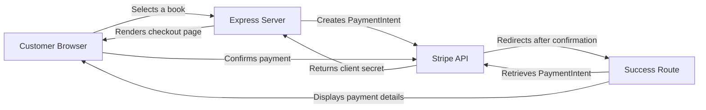

# Stripe Press Payment Integration

## Overview

This demo shows a basic e-commerce payment flow using the [Stripe Payment Element](https://docs.stripe.com/payments/payment-element).

A user can select a book, enter their payment details, complete the payment, and view a confirmation with the final amount and Stripe PaymentIntent ID.

This project is intended as a demonstration and is not production-ready.

## Features

- Select a book from the available catalog.
- Create a PaymentIntent using the selected book price.
- Collect payment information using the Stripe Payment Element.
- Confirm the payment through Stripe.js.
- Display the final amount and PaymentIntent ID.
- Handle basic payment and initialization errors.

## Architecture



The Express server owns the product catalog and prices. It communicates with Stripe using the secret API key.

The browser uses Stripe.js, the publishable key, and the PaymentIntent client secret to render the Payment Element and confirm the payment.

## How It Works

1. The user selects a book.
2. The Express server finds the book and its price.
3. The server creates a PaymentIntent through the Stripe API.
4. Stripe returns a client secret for that PaymentIntent.
5. The server renders the checkout page and passes the client secret to the browser.
6. Stripe.js uses the client secret to initialize the Payment Element.
7. The user enters their payment details and submits the form.
8. `stripe.confirmPayment()` confirms the PaymentIntent.
9. Stripe redirects the user to the success page.
10. The server retrieves the PaymentIntent from Stripe and displays the amount, status, and PaymentIntent ID.

## Stripe APIs and Components

The application uses:

- `stripe.paymentIntents.create()` to create a new payment.
- `stripe.paymentIntents.retrieve()` to verify and display the completed payment.
- Stripe.js to communicate with Stripe from the browser.
- Payment Element to securely collect payment information.
- `stripe.confirmPayment()` to confirm the PaymentIntent.

The Stripe secret key is only used by the server. It is never sent to the browser.

## Project Structure

```text
.
├── app.js
├── PaymentIntent.js
├── package.json
├── public/
├── views/
│   ├── index.hbs
│   ├── checkout.hbs
│   ├── success.hbs
│   └── layouts/
│       └── main.hbs
└── README.md
```

## Running the Application

### Requirements

- Node.js
- npm
- A Stripe account with test API keys

### Installation

Clone the repository and install the dependencies:

```bash
git clone https://github.com/fabian-guevara/stripe
cd stripe
npm install
```

Create a `.env` file in the project root:

```env
STRIPE_SECRET_KEY=sk_test_your_secret_key
STRIPE_PUBLISHABLE_KEY=pk_test_your_publishable_key
PORT=3000
```

Do not commit the `.env` file.

Start the application:

```bash
npm start
```

Open the application at:

```text
http://localhost:3000
```

## Testing

The application should be tested using Stripe test mode. No real card details are required.

### Successful Payment

```text
Card number: 4242 4242 4242 4242
Expiration date: Any future date
CVC: Any three digits
```

### Declined Payment

```text
Card number: 4000 0000 0000 0002
Expiration date: Any future date
CVC: Any three digits
```

### Insufficient Funds

```text
Card number: 4000 0000 0000 9995
Expiration date: Any future date
CVC: Any three digits
```

### 3D Secure Authentication

```text
Card number: 4000 0025 0000 3155
Expiration date: Any future date
CVC: Any three digits
```

Additional test scenarios are available in the [Stripe testing documentation](https://docs.stripe.com/testing).

## Implementation Approach

I used the provided Node.js boilerplate and kept the application intentionally small.

The product catalog and prices are stored on the server. The browser only sends the selected book ID, which prevents a user from changing the price before creating the PaymentIntent.

The server creates the PaymentIntent and sends only its client secret to the browser. The client secret allows Stripe.js to work with that specific payment without exposing the Stripe secret API key.

After the payment is confirmed, the success route retrieves the PaymentIntent directly from Stripe before displaying the amount and status.

## Challenges

The main challenge was understanding how the backend and frontend work together during the PaymentIntent lifecycle.

In particular:

- Creating the PaymentIntent asynchronously before rendering the checkout page.
- Passing the client secret from Express to Handlebars.
- Understanding the difference between the secret key, publishable key, and client secret.
- Confirming the payment from the browser with Stripe.js.
- Retrieving the PaymentIntent after the redirect.

## Production Considerations

For a production implementation, I would extend the application with:

- Webhooks for reliable payment confirmation.
- A database for products, customers, and orders.
- Idempotency keys to prevent duplicate operations.
- Inventory validation.
- Email receipts and order confirmation.
- Logging and monitoring.
- Automated tests.
- HTTPS.
- Better error handling and retry behavior.

The current success page is useful for the demo, but fulfillment should not depend only on the customer returning to the redirect URL. A production system should use Stripe webhooks as the source of truth for payment completion.

## Documentation Used

- [Stripe Payment Element](https://docs.stripe.com/payments/payment-element)
- [Payment Intents API](https://docs.stripe.com/api/payment_intents)
- [Stripe.js Reference](https://docs.stripe.com/js)
- [Stripe Testing](https://docs.stripe.com/testing)
- [Stripe API Keys](https://docs.stripe.com/keys)
